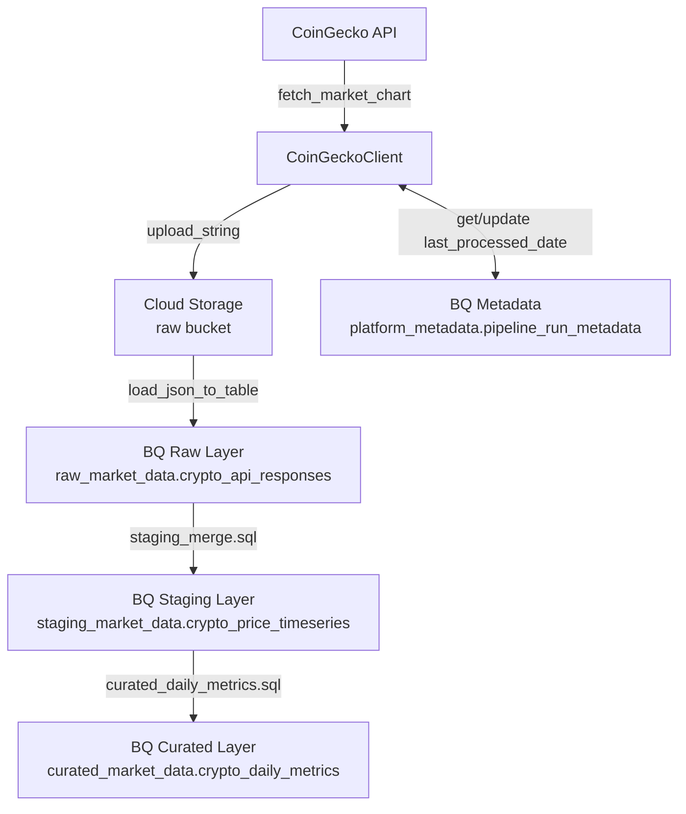
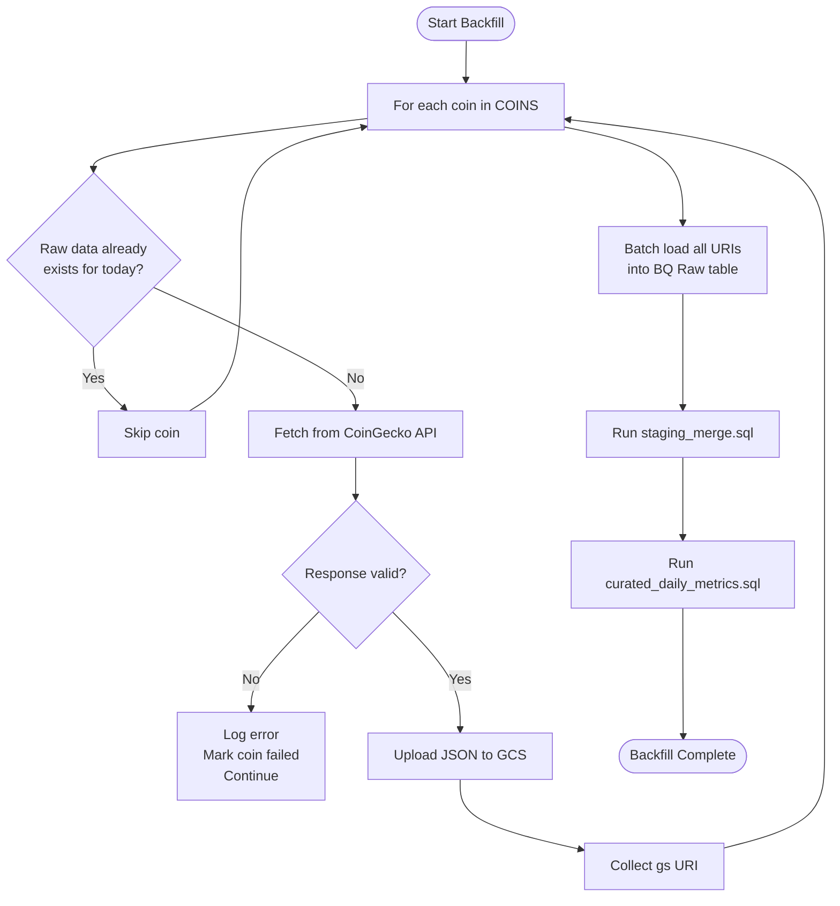
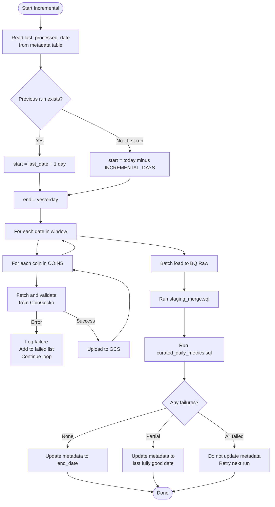
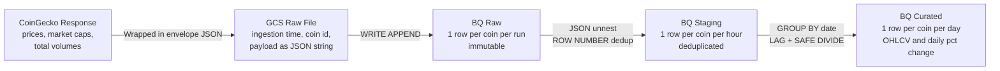

# Crypto Market Data Pipeline


A production-grade batch data pipeline that ingests cryptocurrency market data from the **CoinGecko API**, stores raw JSON in **Google Cloud Storage**, and transforms it through a three-layer **BigQuery medallion architecture** — Raw → Staging → Curated — with idempotent, metadata-driven incremental loads.

---

## Table of Contents

- [Overview](#overview)
- [Features](#features)
- [Tech Stack](#tech-stack)
- [System Architecture](#system-architecture)
- [Project Structure](#project-structure)
- [Pipeline Flows](#pipeline-flows)
- [BigQuery Schema](#bigquery-schema)
- [SQL Transformations](#sql-transformations)
- [Error Handling](#error-handling)
- [Quick Start](#quick-start)
- [Environment Variables](#environment-variables)
- [Running the Pipelines](#running-the-pipelines)
- [Roadmap](#roadmap)

---

## Overview

This project tracks **5 cryptocurrencies** — Bitcoin, Ethereum, Solana, Ripple, Cardano — and builds a clean analytics layer on top of raw API data. It supports two pipeline modes:

| Mode | Purpose | When to Run |
|------|---------|-------------|
| **Backfill** | Load last 90 days of historical data | Once on first setup |
| **Incremental** | Fetch only new data since last run | Daily via scheduler |

---

## Features

- **Two pipeline modes** — Backfill (90 days) and incremental with automatic resume-from-last-date
- **Resilient API client** — exponential backoff, 429 handling, request timeouts, response validation
- **Idempotent design** — safe to re-run; MERGE statements and pre-load checks prevent duplicates
- **Medallion architecture** — Raw → Staging → Curated with progressively cleaner data at each layer
- **Metadata tracking** — pipeline state stored in BigQuery; incremental runs resume automatically
- **Per-coin isolation** — one failed coin never stops others; SQL transforms still run on available data
- **Parameterized SQL** — no f-string SQL injection risk in any BigQuery query

---

## Tech Stack

| Layer | Technology | Purpose |
|-------|-----------|---------|
| Data Source | CoinGecko API v3 | Historical OHLCV market data |
| Ingestion | Python, requests | HTTP client with retry, backoff, timeout, validation |
| Raw Storage | Google Cloud Storage | Immutable raw JSON landing zone |
| Data Warehouse | Google BigQuery | Three-layer medallion architecture |
| Transformation | BigQuery SQL (MERGE) | JSON flattening, deduplication, daily aggregation |
| Orchestration | Python, main.py | Pipeline runner — extensible to Cloud Scheduler |
| Config | python-dotenv | Environment-based configuration, no hardcoded secrets |
| Logging | Python logging | Per-module logging, level controlled via environment |

---

## System Architecture



---

## Project Structure

```
crypto-market-data-pipeline/
│
├── configs/
│   └── settings.py                    # All constants — project, datasets, coins, days
│
├── src/
│   ├── ingestion/
│   │   └── coingecko_client.py        # API client — retry, timeout, validation
│   │
│   ├── infrastructure/
│   │   ├── bigquery_client.py         # BigQuery SDK wrapper with error handling
│   │   └── storage_client.py          # Cloud Storage SDK wrapper
│   │
│   ├── metadata/
│   │   └── metadata_manager.py        # Pipeline state — parameterized SQL MERGE
│   │
│   ├── pipelines/
│   │   ├── backfill_pipeline.py       # Historical load (90 days) with idempotency
│   │   └── incremental_pipeline.py    # Daily incremental with smart resume logic
│   │
│   ├── transformation/
│   │   ├── staging_merge.sql          # JSON flatten + dedup into staging
│   │   └── curated_daily_metrics.sql  # Daily OHLCV aggregation into curated
│   │
│   └── utils/
│       └── logger.py                  # Named logger factory — level from env var
│
├── .env                               # Environment variables (never commit)
├── .gitignore
└── main.py                            # Entry point — selects pipeline mode
```

---

## Pipeline Flows

### Backfill Pipeline



---

### Incremental Pipeline



---

### Data Flow Through BigQuery Layers



---

## BigQuery Schema

### `raw_market_data.crypto_api_responses`

Immutable landing table. Raw API responses stored as-is — never modified after insert.

| Column | Type | Description |
|--------|------|-------------|
| `ingestion_time` | TIMESTAMP | UTC time the record was written |
| `coin_id` | STRING | CoinGecko coin ID e.g. `bitcoin` |
| `api_days_requested` | INTEGER | Number of days requested in the API call |
| `payload` | STRING | Full raw JSON response — prices, market_caps, total_volumes |

---

### `staging_market_data.crypto_price_timeseries`

Flattened, deduplicated timeseries. One row per `(coin_id, event_time)`.

| Column | Type | Key | Description |
|--------|------|-----|-------------|
| `coin_id` | STRING | PK | Coin identifier |
| `event_time` | TIMESTAMP | PK | Market data timestamp from CoinGecko |
| `price_usd` | FLOAT64 | | Price in USD at this timestamp |
| `market_cap` | FLOAT64 | | Market capitalisation in USD |
| `total_volume` | FLOAT64 | | 24h trading volume in USD |
| `ingestion_time` | TIMESTAMP | | When ingested — used for dedup ordering |

---

### `curated_market_data.crypto_daily_metrics`

Daily aggregated business metrics. The analytics-ready output layer.

| Column | Type | Key | Description |
|--------|------|-----|-------------|
| `coin_id` | STRING | PK | Coin identifier |
| `date` | DATE | PK | Calendar date |
| `avg_price` | FLOAT64 | | Average price across all intraday data points |
| `max_price` | FLOAT64 | | Daily high price |
| `min_price` | FLOAT64 | | Daily low price |
| `total_volume` | FLOAT64 | | Sum of all intraday volume |
| `avg_market_cap` | FLOAT64 | | Average market cap for the day |
| `daily_price_change_pct` | FLOAT64 | | Percentage change vs previous day (SAFE_DIVIDE) |

---

### `platform_metadata.pipeline_run_metadata`

| Column | Type | Key | Description |
|--------|------|-----|-------------|
| `pipeline_name` | STRING | PK | e.g. `crypto_incremental_pipeline` |
| `last_processed_date` | DATE | | Last date fully processed — used as resume point |
| `updated_at` | TIMESTAMP | | When this record was last written |

---

## SQL Transformations

### `staging_merge.sql` — JSON Flatten and Deduplicate

Reads raw JSON from BigQuery, unnests the three parallel arrays (prices, market_caps, total_volumes), joins them by array index, and deduplicates before merging.

**Key design decisions:**

- `ROW_NUMBER() OVER (PARTITION BY coin_id, event_time ORDER BY ingestion_time DESC)` — keeps the latest ingestion if the same timestamp appears twice, making reruns safe
- Three-way `UNNEST ... WITH OFFSET` join keeps prices, market caps, and volumes aligned by index position
- `TIMESTAMP_MILLIS()` converts CoinGecko's Unix millisecond timestamps to BigQuery TIMESTAMP type
- `MERGE ON (coin_id, event_time)` handles both first inserts and re-ingestion of corrected data cleanly

---

### `curated_daily_metrics.sql` — Daily Aggregation

Rolls up the hourly staging timeseries into one row per coin per day.

**Key design decisions:**

- `AVG / MAX / MIN (price_usd)` gives average, daily high, and daily low price
- `LAG(avg_price) OVER (PARTITION BY coin_id ORDER BY date)` fetches the previous day's price for percentage change calculation
- `SAFE_DIVIDE()` prevents division-by-zero when previous price is zero (e.g. newly listed coins)
- `MERGE ON (coin_id, date)` makes daily reruns fully idempotent — existing rows updated, new rows inserted

---

## Error Handling

### Strategy by Component

| Component | What Can Fail | How It Is Handled |
|-----------|--------------|------------------|
| `CoinGeckoClient` | 429, 5xx, timeout, empty response | Retry adapter (5x backoff), timeout=(5,30), ValueError on bad payload |
| `StorageClient` | Network error, GCS unavailable | `Retry(deadline=60)` on every upload call |
| `BigQueryClient` | API error, partial job errors | `GoogleAPIError` caught, `job.errors` always checked after completion |
| `MetadataManager` | BQ unavailable, missing table | `GoogleAPIError` caught and re-raised with full traceback |
| `BackfillPipeline` | Any coin-level failure | Per-coin try/except — failed coins collected, transforms still run |
| `IncrementalPipeline` | Any coin/date failure | Per-pair try/except — metadata only advanced to last clean date |

### Retry Strategy on CoinGecko API

```
Attempt 1  → fails with 429
Wait 2s
Attempt 2  → fails with 503
Wait 4s
Attempt 3  → fails with 503
Wait 8s
Attempt 4  → success
```

The retry adapter respects CoinGecko's `Retry-After` response header when present, and applies exponential backoff (2s → 4s → 8s → 16s → 32s) for up to 5 attempts.

### Metadata Safety

```
All coins succeeded   →  update metadata to end_date
Some coins failed     →  update metadata to last fully successful date
                         (failed dates auto-retry on next run)
All coins failed      →  do NOT update metadata
                         (entire window retries on next run)
```

---

## Quick Start

### 1. Clone and Install

```bash
git clone https://github.com/safiyapatel722/crypto-market-data-pipeline.git
cd crypto-market-data-pipeline

python -m venv virtual-env
source virtual-env/bin/activate        # Windows: venv\Scripts\activate

pip install -r requirements.txt
```

### 2. Authenticate with GCP

```bash
gcloud auth application-default login
gcloud config set project YOUR_PROJECT_ID
```

### 3. Create GCP Resources

```bash
# Cloud Storage bucket
gsutil mb -l us gs://crypto-market-raw-data-us

# BigQuery datasets
bq mk --dataset YOUR_PROJECT_ID:raw_market_data
bq mk --dataset YOUR_PROJECT_ID:staging_market_data
bq mk --dataset YOUR_PROJECT_ID:curated_market_data
bq mk --dataset YOUR_PROJECT_ID:platform_metadata
```

### 4. Configure Environment

Create a `.env` file in the project root and populate it with your values (see [Environment Variables](#environment-variables)):

```bash
touch .env
```

### 5. Run Backfill (first time only)

```bash
python main.py --mode backfill
```

### 6. Run Incremental (daily)

```bash
python main.py --mode incremental
```

> **Important:** Always run backfill before setting up the daily incremental schedule. The incremental pipeline reads the metadata pointer written by backfill to know where to start.

---

## Environment Variables

| Variable | Required | Default | Description |
|----------|----------|---------|-------------|
| `PROJECT_ID` | Yes | — | Your GCP project ID |
| `RAW_BUCKET` | No | `crypto-market-raw-data-us` | GCS bucket for raw JSON files |
| `BACKFILL_DAYS` | No | `90` | Days of history to load in backfill mode |
| `INCREMENTAL_DAYS` | No | `2` | Sliding window size for incremental fetch |
| `COINGECKO_API_KEY` | No | *(empty)* | Pro API key — free tier used if blank |
| `LOG_LEVEL` | No | `INFO` | Verbosity: `DEBUG`, `INFO`, `WARNING`, `ERROR` |

```bash
# .env
PROJECT_ID=your-gcp-project-id
RAW_BUCKET=crypto-market-raw-data-us
BACKFILL_DAYS=90
INCREMENTAL_DAYS=2
COINGECKO_API_KEY=
LOG_LEVEL=INFO
```

---

## Running the Pipelines

### Backfill

```bash
python main.py --mode backfill
```

Idempotent — re-running skips coins that already have raw data loaded for today.

### Incremental

```bash
python main.py --mode incremental
```

Automatically resumes from the last successfully processed date stored in metadata.

### Schedule with Cloud Scheduler

```bash
gcloud scheduler jobs create http crypto-incremental \
  --schedule="0 6 * * *" \
  --uri="https://YOUR_CLOUD_RUN_URL/run" \
  --time-zone="UTC" \
  --message-body='{"mode": "incremental"}'
```

---

## Roadmap

| Status | Feature |
|--------|---------|
| Done | Backfill pipeline with idempotency check |
| Done | Incremental pipeline with smart resume logic |
| Done | Three-layer BigQuery medallion architecture |
| Done | Retry adapter and timeouts on all API calls |
| Done | Parameterized queries — SQL injection protection |
| Done | Per-coin error isolation |
| Done | Unit tests with mocked GCP clients
| Next | Integration tests with mocked GCP clients |
| Next | GitHub Actions CI — run tests on every push |
| Next | Slack or email alerting on pipeline failure |
| Future | Cloud Run deployment with Cloud Scheduler trigger |
| Future | Looker Studio dashboard on the curated layer |
| Future | Expand coin list via config file, not code |

---

## Requirements

```
google-cloud-bigquery>=3.11.0
google-cloud-storage>=2.10.0
requests>=2.31.0
urllib3>=2.0.0
python-dotenv>=1.0.0
pytest>=7.0.0
responses>=0.25.0
```

---

*Built with Python and Google Cloud Platform — CoinGecko API v3*
